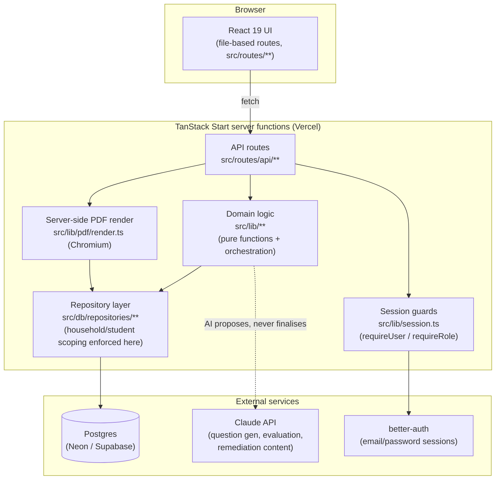

# Architecture (F111)

One-paragraph version: TanStack Start (React 19, file-based routes) talks to Postgres through a
typed repository layer built on Kysely; every table is scoped to a household or student at the
repository boundary, not the route handler; AI calls (Claude, via `@anthropic-ai/sdk`) only ever
*propose* — evaluation marks, remediation content, generated questions — and a human or a
deterministic rule confirms before anything becomes load-bearing data.

See `CLAUDE.md` for the product framing and the five hard invariants (chapter identity, board/class
as columns, question depth as config, append-only history, every question traces to a scoped
concept) — they aren't repeated here, this doc covers how the code is organised to hold them.

## System diagram

## Why a repository layer, not routes-talk-to-Kysely-directly

ESLint's `no-restricted-imports` blocks raw `kysely`/`pg` imports outside `src/db/**`. The reason
is structural, not stylistic: `createRepository` / `createScopedRepository` (in
`src/db/repositories/`) bake the `household_id` / `student_id` filter into every query the
repository can produce, so a new route literally cannot forget to scope a query — the alternative
(remembering a `WHERE household_id = ?` in every handler) is exactly the kind of thing that gets
forgotten under deadline pressure and turns into a cross-household data leak (T02 in tab 12 is the
regression test for this class of bug; `src/routes/cross-household-access.integration.test.ts` and
`src/routes/household-isolation.integration.test.ts` automate it against the real dev DB).

## Request flow, one example (confirming an evaluation — F047)

1. `POST /api/evaluations/:id/confirm` (`src/routes/api/evaluations/$id/confirm.ts`) calls
   `requireRole(request, 'parent', 'admin')`.
2. The route hands off to `src/lib/evaluation.ts`'s `confirmEvaluation()`.
3. That function opens **one** Kysely transaction, reads the AI-proposed marks via the repository
   layer, lets a human override land on top, writes the confirmed `evaluation_items` rows, and
   updates `concept_mastery` / `concept_status` — all inside that one transaction.
4. It also writes an `audit_log` row (`evaluation.confirmed`) — this is the one write in the whole
   app that finalises a mark, and it's traceable.
5. Only *confirmed* evaluations are ever read by the dashboard/mastery code — an AI-proposed,
   unconfirmed mark is invisible to `src/lib/dashboard.ts` and friends by construction (the
   repository query for mastery reads `evaluations.confirmed_at is not null`).

## A structural gotcha worth knowing before you touch multi-step writes

Kysely's `Transaction` object does not support opening a nested transaction — calling
`db.transaction()` again inside a callback that already received a `Transaction` throws. Anything
that needs multiple DB round trips inside one logical operation (e.g. `src/lib/remediation.ts`'s
`submitDrillAttempt()`) has to structure itself as **one** transaction for the writes that must be
atomic together, then plain top-level `db` calls (each opening its own transaction) for steps that
are logically sequential but don't need the same atomicity boundary. See the comment at the top of
`submitDrillAttempt()` for the concrete pattern.

## AI layer

Every AI call lives in `src/lib/ai-*.ts` (question generation, evaluation, remediation content) and
is gated by an `isXConfigured()` check so the app degrades to "feature unavailable" rather than
throwing when `ANTHROPIC_API_KEY` is unset — see `docs/PROMPT_CATALOGUE.md` for the actual prompt
contracts, models, and guardrails per function.

## Directory map

| Path | What lives there |
|---|---|
| `src/routes/**` (non-`api`) | Screens (file-based routing → URL) |
| `src/routes/api/**` | Server routes — every one calls `requireUser`/`requireRole` first |
| `src/lib/**` | Domain logic: pure functions where possible, orchestration where not. No raw `kysely` imports (ESLint-enforced) |
| `src/db/repositories/**` | The only place allowed to import `kysely`/`sql` directly. Household/student scoping lives here |
| `src/db/migrations/**` | One file per schema change, `up`/`down` both implemented and tested |
| `src/db/types.ts` | Generated by `kysely-codegen` (`npm run db:codegen`) — never hand-edited |
| `src/components/**` | Shared UI (shadcn/ui primitives + `components/charts/**` for the dataviz-skill-compliant chart set) |
| `e2e/**` | Playwright E2E specs (`npm run test:e2e`) — real browser, real dev server, real dev DB |
| `docs/decisions/**` | Architecture Decision Records — see F111 decision log below |

## Decision log

Significant, hard-to-reverse architectural calls are recorded as ADRs in `docs/decisions/` (see
`ADR-0001-chapter-identity.md` for the format). Add a new `ADR-NNNN-slug.md` there — Context /
Decision / Consequences — whenever a future change reopens a decision that cost real debate; don't
retroactively write one for every commit.
